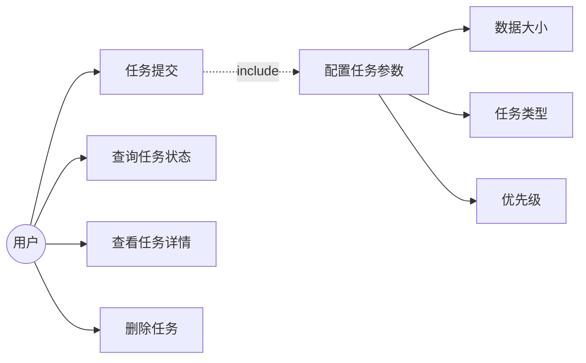
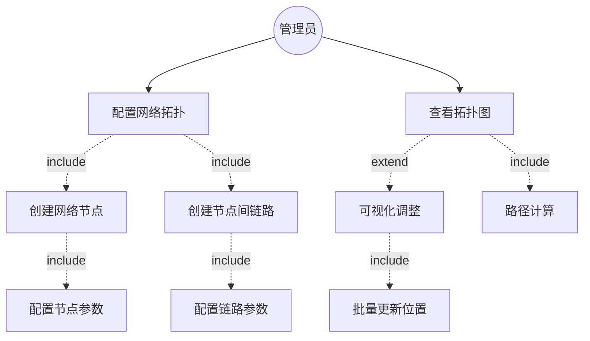
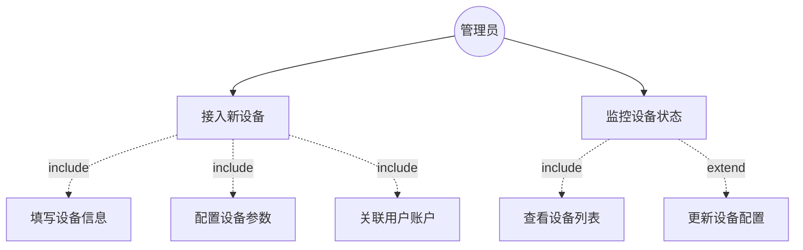
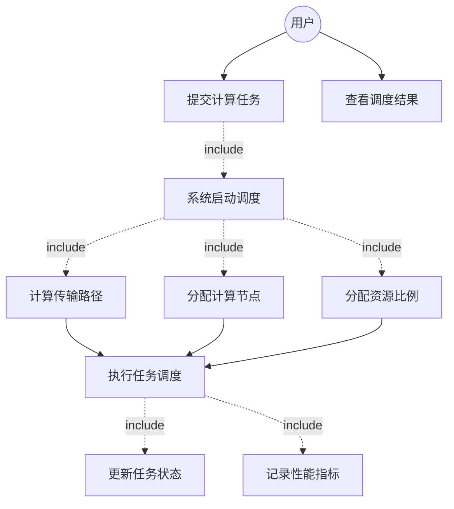
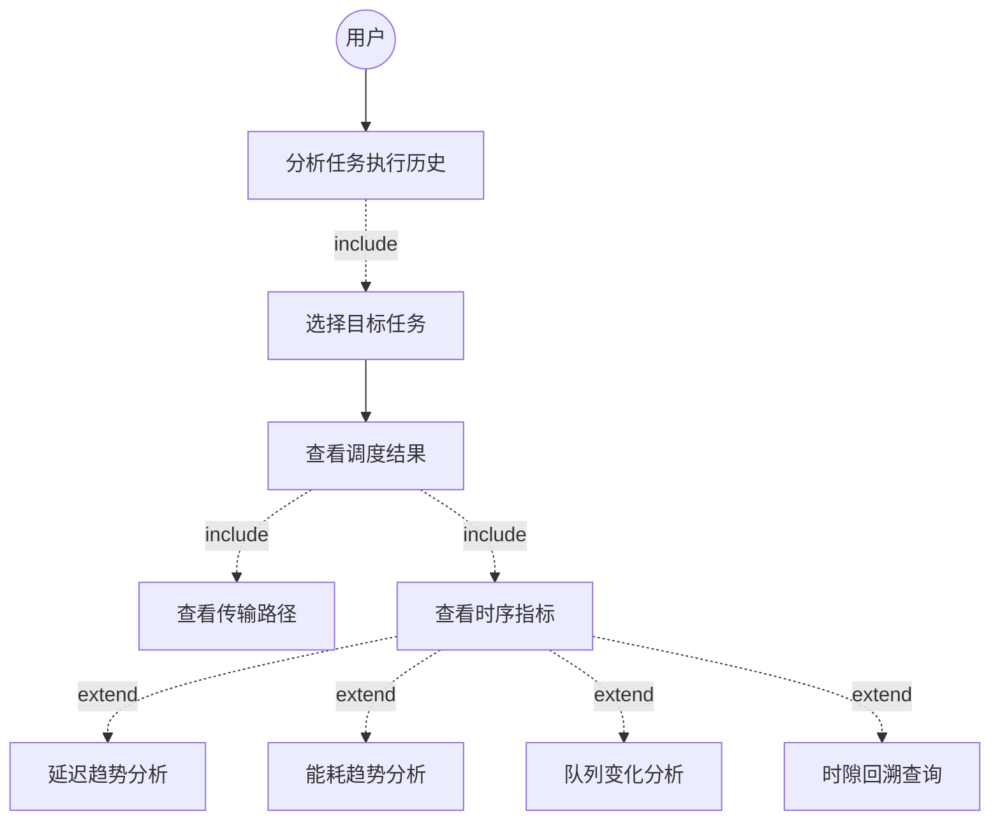

# 研究点二：应急场景下无人机网络资源分配系统

## 背景与动机

随着网络功能虚拟化（Network Function Virtualization, NFV）技术的不断演进，5G核心网的部署方式正在经历深刻变革。目前已涌现出多种基于NFV架构的开源5G核心网实现，如Open5gs和Free5gc等，这些系统通过软件方式模拟各个网元的硬件能力，从根本上支持了网元的分布式部署。然而，现有系统在实际应用场景中仍面临诸多挑战：一方面，缺少针对应急场景下多无人机协作网络的实践案例；另一方面，传统的资源管理方式难以满足动态环境中的高效任务卸载和资源分配需求。

针对这些问题，本课题在两个层面展开研究。首先，在基础设施层面，探索并实现了基于Docker容器化技术的5G核心网网元分布式部署方案，成功将软件无线电设备接入网络，验证了容器化部署在实际无线通信场景中的可行性。这一工作为研究点一提出的LDO-2P（Lyapunov Drift-Plus-Penalty）算法的实际应用奠定了基础能力。

其次，在资源管理层面，针对应急场景下多无人机分布式网络架构的特殊需求，设计并实现了一套高效的无人机网络资源分配系统。该系统不同于传统的网络资源管理平台，后者通常仅提供基础的数据管理功能，且网络架构相对固定。本系统则专门面向应急场景的动态特性，具备以下核心能力：

1. **多层次资源管理**：统一管理用户设备、无人机基站等异构网络资源，支持设备状态实时监控与拓扑动态更新；

2. **任务粒度调度优化**：在研究点一LDO-2P算法的基础上进行改进，将调度粒度从用户维度细化为任务维度，实现更精细的资源分配策略；

3. **可视化验证平台**：提供完整的Web管理界面，支持任务提交、网络拓扑可视化、实时监控和性能统计分析，为算法验证和系统调优提供直观的工具支持。

通过上述工作，本系统不仅验证了研究点一提出的理论算法在实际网络环境中的有效性，更为应急场景下的无人机网络资源管理提供了一套完整的解决方案，弥补了现有系统在该领域的空白。

---

## a) 系统功能需求分析

针对应急场景下无人机网络的动态特性和资源约束，本系统需要实现任务管理、网络拓扑管理、智能调度和性能监控等核心功能。基于研究点一提出的LDO-2P算法，系统通过Web界面提供算法验证和实时监控能力。

### 1. 任务提交与管理

系统需支持用户通过Web界面或API提交计算任务，并对任务全生命周期进行管理。用户提交任务时需指定数据大小、任务类型、优先级等参数。系统应支持批量任务提交，并为每个任务生成唯一标识符。任务管理功能包括查询任务状态、查看任务详情、删除任务等操作。

**用例图**：


**核心功能实现**：
- 任务提交接口（POST /api/v1/algorithm/start）：支持单个或批量任务提交
- 任务查询接口（GET /api/v1/algorithm/tasks）：支持分页、按用户ID和状态筛选
- 任务详情接口（GET /api/v1/algorithm/tasks/:id）：获取任务完整信息和历史指标
- 任务删除接口（DELETE /api/v1/algorithm/tasks/:id）
- 前端任务管理页面（views/device/task/index.vue）：任务列表展示和创建表单
- 数据模型：Task（包含ID、名称、类型、用户ID、数据大小、优先级、状态等字段）

---

### 2. 网络拓扑配置与可视化

系统需提供网络拓扑的配置和可视化功能。管理员通过创建节点（网关、边缘节点、卫星节点）和链路，构建无人机网络拓扑。配置完成后，系统自动计算节点间的最短路径，并在前端可视化展示网络结构。管理员可以拖拽调整节点位置，批量更新坐标，系统实时更新拓扑图。

**用例图**：


**核心功能实现**：
- 节点管理接口（/api/v1/network/nodes）：
  - GET：获取节点列表
  - POST：创建新节点
  - GET /:id：获取节点详情
  - PUT /:id：更新节点信息
  - DELETE /:id：删除节点
  - PATCH /batch-position：批量更新节点位置
- 链路管理接口（/api/v1/network/links）：
  - GET：获取链路列表
  - POST：创建新链路
  - GET /:id：获取链路详情
  - PUT /:id：更新链路信息
  - DELETE /:id：删除链路
- 拓扑查询接口（GET /api/v1/network/topology）：返回完整的节点和链路数据
- 前端拓扑管理页面：
  - views/network/node/index.vue：节点管理
  - views/network/link/index.vue：链路管理
  - views/network/home/index.vue：拓扑可视化
- 数据模型：Node（名称、类型、位置、状态）、Link（源节点、目标节点、带宽、时延、状态）

---

### 3. 用户设备接入管理

系统需支持用户设备的接入和管理。当新用户设备（如手机、IoT设备）接入网络时，管理员在系统中注册设备信息（MAC地址、IP地址、设备类型），配置设备参数（厂商、版本、配置JSON），并关联到用户账户。系统记录设备状态（在线/离线/故障），管理员可实时监控设备运行状态。

**用例图**：


**核心功能实现**：
- 设备管理接口（/api/v1/devices）：
  - GET：获取设备列表
  - POST：注册新设备
  - GET /:id：获取设备详情
  - PUT /:id：更新设备信息
  - DELETE /:id：删除设备
- 前端设备管理页面（views/device/home/index.vue）：设备列表和表单
- 数据模型：Device（名称、类型、MAC、IP、状态、厂商、版本、位置、配置、用户ID）

---

### 4. 智能任务调度与执行

系统需实现基于Lyapunov优化理论的智能任务调度功能。用户提交任务后，系统自动启动调度器。调度器每秒运行一次（1秒/时隙），为每个任务计算最优的传输路径（Floyd最短路径）和计算节点分配（基于队列长度的贪心策略），平衡队列稳定性、延迟和能耗。任务执行过程中，系统实时更新任务状态（等待→排队→计算→完成），并记录每个时隙的性能指标。

**用例图**：


**核心功能实现**：
- 调度系统管理（internal/algorithm/system.go）：
  - 单例模式管理全局调度器
  - 时隙定时器（1秒/时隙）
  - 任务生命周期管理
- 路径计算（internal/algorithm/graph.go）：
  - Floyd-Warshall最短路径算法
  - 构建邻接矩阵和路径矩阵
  - 计算任务传输路径
- 资源分配算法（internal/algorithm/graph.go - schedule方法）：
  - Lyapunov Drift-Plus-Penalty优化
  - 随机化贪心调度策略
  - 队列感知的资源分配
  - 成本函数：Drift + V × Penalty（平衡队列稳定性与性能）
- 任务状态管理（internal/algorithm/task_manager.go）：
  - 状态转换：Pending → Queued → Computing → Completed/Failed
  - 历史指标记录（MetricsHistory）
- 调度控制接口：
  - POST /api/v1/algorithm/start：启动调度并提交任务
  - POST /api/v1/algorithm/stop：停止调度
  - GET /api/v1/algorithm/info：获取调度状态（运行状态、当前时隙、任务数等）
  - POST /api/v1/algorithm/clear：清除历史记录
- 前端调度监控页面（views/network/home/index.vue）：
  - 实时队列长度趋势图
  - 延迟趋势图
  - 能耗趋势图
  - 网络拓扑与任务分配可视化

---

### 5. 任务执行历史分析

系统需提供任务执行过程的详细历史分析功能。用户选择某个已完成或执行中的任务，系统展示该任务从提交到完成的完整执行过程：分配的计算节点、传输路径、每个时隙的队列长度、处理进度、资源分配比例。系统提供可视化图表，包括延迟趋势曲线、能耗趋势曲线、任务进度曲线，并支持按时隙回溯查看每个时刻的详细指标。用户可对比多个任务的性能差异，评估调度算法的效果。

**用例图**：


**核心功能实现**：
- 系统概览接口（GET /api/v1/overview）：
  - 聚合系统状态（总设备数、总节点数、总链路数、总任务数等）
- 调度状态接口（GET /api/v1/algorithm/info）：
  - 返回调度运行状态、当前时隙、活跃任务数、完成任务数
- 任务历史查询（GET /api/v1/algorithm/tasks/:id）：
  - 返回任务完整的MetricsHistory数组
  - 每个时隙记录包含：传输延迟、计算延迟、传输能耗、计算能耗、队列长度、处理进度、资源分配比例
- 前端性能统计页面：
  - 系统概览页（views/home/index.vue）：
    - CardData：关键指标卡片
    - PerfChart：系统性能趋势图
    - LineChart/BarChart：多维度对比图
    - NodeTable/LinkTable：资源状态表
  - 网络监控页（views/network/home/index.vue）：
    - QueueLineChart：队列长度时序图
    - DelayLineChart：系统延迟时序图
    - EnergyLineChart：系统能耗时序图
    - GraphData：网络拓扑实时状态
  - 任务详情页（views/device/task-detail/index.vue）：
    - DelayChart：任务延迟历史曲线
    - EnergyChart：任务能耗历史曲线
    - ProgressChart：任务进度曲线
    - GraphData：任务传输路径可视化
    - 支持按时隙回溯每个指标的变化
- 数据模型：
  - SlotMetrics：单时隙指标快照
  - TaskMetrics：任务性能指标（延迟、能耗）
  - SystemMetrics：系统级聚合指标

---

## b) 系统整体架构

本系统采用分层架构设计，自上而下分为前端展示层、后端服务层、算法引擎层和数据存储层四个核心模块。前端展示层基于Vue.js框架实现，提供网络拓扑可视化、任务管理、性能监控等功能界面，通过HTTP RESTful API与后端进行通信，采用JWT机制保障接口安全性。后端服务层采用Go语言和Gin框架构建，遵循标准的三层架构模式：API层负责路由管理、请求验证和响应封装；业务逻辑层提供用户管理、设备管理、网络管理和算法调度等核心服务；数据访问层采用Repository模式，通过GORM框架实现对SQLite数据库的操作。算法引擎层是系统的核心，包含System系统管理器、Graph网络拓扑模块、TaskManager任务管理器和State状态管理器四个关键组件。System采用单例模式管理全局调度器，以1秒为时隙周期运行调度循环；Graph模块通过Floyd-Warshall算法计算节点间最短路径，构建邻接矩阵和路径矩阵；TaskManager负责任务的全生命周期管理，实现Pending→Queued→Computing→Completed的状态转换；State模块通过TaskSnapshot机制记录每个时隙的调度快照，计算队列长度、延迟、能耗等性能指标。资源分配算法基于研究点一提出的LDO-2P理论，采用Lyapunov Drift-Plus-Penalty优化框架，通过贪心随机化策略和队列感知机制，在保证队列稳定性的前提下优化系统延迟和能耗。数据存储层采用SQLite轻量级数据库，存储用户、设备、节点、链路等基础数据，任务的历史性能指标以JSON格式存储在MetricsHistory字段中，支持按时隙回溯查询。整个系统实现了从用户任务提交、网络拓扑配置、智能调度执行到性能分析展示的完整闭环，为应急场景下的无人机网络资源管理提供了一套可验证、可监控的解决方案。

### 系统整体架构图

```
┌─────────────────────────────────────────────────────────────┐
│                        前端展示层                            │
│                     (Web前端应用 - Vue.js)                   │
├─────────────────────────────────────────────────────────────┤
│  资源信息展示  │  业务信息展示  │  局部观察展示  │  拓扑可视化  │
│  分配结果展示  │  调度执行日志  │  性能统计展示  │  实时监控    │
└─────────────────────────────────────────────────────────────┘
                              ↓
                    HTTP RESTful API + JWT认证
                              ↓
┌─────────────────────────────────────────────────────────────┐
│                       后端服务层 (Go + Gin)                  │
├─────────────────────────────────────────────────────────────┤
│  API接口层         │  业务逻辑层        │  数据访问层         │
│  - 路由管理        │  - 用户服务        │  - Repository模式   │
│  - JWT中间件       │  - 设备服务        │  - GORM ORM        │
│  - 请求验证        │  - 网络服务        │  - 数据模型         │
│  - 响应封装        │  - 算法服务        │                    │
└─────────────────────────────────────────────────────────────┘
                              ↓
┌─────────────────────────────────────────────────────────────┐
│                    算法引擎层 (核心调度系统)                  │
├─────────────────────────────────────────────────────────────┤
│  System (系统管理器)                                         │
│  ├── 时隙调度循环 (1秒/时隙)                                 │
│  ├── 任务生命周期管理                                        │
│  └── 状态同步与持久化                                        │
│                                                             │
│  Graph (网络拓扑与路径计算)                                   │
│  ├── Floyd-Warshall 最短路径                                 │
│  ├── 邻接矩阵构建                                            │
│  └── 传输路径计算                                            │
│                                                             │
│  TaskManager (任务管理器)                                    │
│  ├── 任务提交与跟踪                                          │
│  ├── 状态转换 (Pending→Queued→Computing→Completed)           │
│  └── 用户任务映射                                            │
│                                                             │
│  State (调度状态管理)                                        │
│  ├── TaskSnapshot (任务快照)                                 │
│  ├── 队列管理与资源分配                                       │
│  └── 性能指标计算                                            │
│                                                             │
│  资源分配算法 (LDO-2P - Lyapunov Drift-Plus-Penalty)          │
│  ├── 贪心随机化调度                                          │
│  ├── 队列感知资源分配                                        │
│  ├── 成本函数优化 (Drift + V × Penalty)                      │
│  └── 早停机制 (成本稳定时终止迭代)                             │
└─────────────────────────────────────────────────────────────┘
                              ↓
┌─────────────────────────────────────────────────────────────┐
│                       数据存储层                             │
├─────────────────────────────────────────────────────────────┤
│  SQLite 数据库 (data.db)                                     │
│  ├── 用户表 (users)                                          │
│  ├── 设备表 (devices)                                        │
│  ├── 节点表 (nodes)                                          │
│  ├── 链路表 (links)                                          │
│  └── 任务历史指标 (metrics_history - JSON字段)                │
│                                                             │
│  算法库模块                                                  │
│  ├── 常量定义 (constant/)                                    │
│  │   └── 时隙、迭代次数、能耗参数、Lyapunov权重V              │
│  └── 数据结构 (define/)                                      │
│      ├── Task (持久化对象)                                   │
│      ├── TaskSnapshot (临时计算上下文)                        │
│      └── Metrics (性能指标)                                  │
└─────────────────────────────────────────────────────────────┘
```

### 数据流向图

```
用户提交任务
    ↓
前端 (TaskCreate) → POST /api/v1/algorithm/start
    ↓
API Handler → 参数验证
    ↓
System.SubmitBatchTasks()
    ↓
TaskManager.addTask() → 创建Task对象 (状态: Pending)
    ↓
System 启动调度循环 (每秒1个时隙)
    ↓
┌────────────── 时隙调度循环 ──────────────┐
│  1. State.createSnapshot()              │
│     - 获取所有活跃任务                   │
│     - 创建TaskSnapshot                  │
│                                         │
│  2. Graph.schedule(state)               │
│     - 多次随机迭代 (constant.Iters)      │
│     - 为每个任务随机选择计算节点          │
│     - Floyd计算传输路径                  │
│     - 队列感知分配资源                   │
│     - 计算成本 = Drift + V × Penalty    │
│     - 保留最优状态                       │
│                                         │
│  3. State.computeMetrics()              │
│     - 计算传输延迟、能耗                 │
│     - 计算计算延迟、能耗                 │
│     - 更新队列长度                       │
│                                         │
│  4. TaskManager.syncFromState()         │
│     - 更新Task.MetricsHistory           │
│     - 状态转换 (Pending→Queued→Computing)│
│     - 检查任务完成 (processed >= dataSize)│
│                                         │
│  5. 下一时隙 (若仍有活跃任务)             │
└─────────────────────────────────────────┘
    ↓
任务完成 → 状态: Completed
    ↓
前端轮询 GET /api/v1/algorithm/tasks/:id
    ↓
获取完整历史指标 (MetricsHistory[])
    ↓
可视化展示 (DelayChart, EnergyChart, ProgressChart)
```

### 关键设计特点

#### 1. 分层架构
- **API层**：路由、中间件、请求处理（internal/api/）
- **Service层**：业务逻辑、事务管理（internal/service/）
- **Repository层**：数据访问抽象（internal/repository/）
- **Model层**：数据模型定义（internal/models/）

#### 2. 算法引擎独立性
- 独立的 `algorithm` 包（internal/algorithm/）
- 单例模式管理调度系统（System）
- 可扩展的任务管理机制（TaskManager）
- 模块化的指标计算（State）
- 支持实时调度和历史回溯

#### 3. 数据模型分离
- **Task**：持久化对象，包含完整历史（MetricsHistory[]）
- **TaskSnapshot**：临时计算上下文（队列、资源分配比例）
- **严格分离**：避免混淆持久化字段与临时计算字段

#### 4. 并发安全
- 算法引擎运行在独立goroutine（时隙ticker调度）
- 读写锁保护共享状态：
  - `s.mutex.Lock()` - 写操作
  - `s.mutex.RLock()` - 读操作
- 关键竞争点：
  - TaskManager.Tasks（多goroutine访问）
  - System.CurrentState（API读取 + 调度写入）

#### 5. RESTful API设计
- 标准HTTP方法（GET/POST/PUT/DELETE）
- 统一响应格式（utils.Response）
- JWT认证机制（middleware.AuthMiddleware）
- Swagger文档支持（/swagger/index.html）

---

## 模块功能详细说明

### 1. 前端展示模块

前端采用Vue.js框架，包括以下核心界面：

#### 资源信息展示
- **功能**：展示各节点的计算、内存、存储等资源信息
- **实现**：
  - views/home/modules/card-data.vue：关键指标卡片
  - views/home/modules/node-table.vue：节点列表
  - 数据来源：GET /api/v1/overview、GET /api/v1/network/nodes

#### 业务信息展示
- **功能**：展示任务的拓扑图、各任务的资源需求
- **实现**：
  - views/device/task/index.vue：任务列表（支持筛选、分页）
  - 任务参数：ID、名称、类型、数据大小、优先级、状态
  - 数据来源：GET /api/v1/algorithm/tasks

#### 局部观察展示
- **功能**：展示当前系统的网络局部拓扑图，点击节点查看性能指标
- **实现**：
  - views/network/home/components/graph-data.vue：拓扑可视化
  - 支持节点拖拽、位置批量更新（PATCH /api/v1/network/nodes/batch-position）
  - 数据来源：GET /api/v1/network/topology

#### 分配结果展示
- **功能**：展示任务在算网资源下的部署结果
- **实现**：
  - views/device/task-detail/index.vue：任务详情页
  - 显示：分配的计算节点（AssignedCommID）、传输路径（TransferPath）
  - 数据来源：GET /api/v1/algorithm/tasks/:id

#### 调度执行日志
- **功能**：提供调度的结果信息和执行日志
- **实现**：
  - views/log/home/index.vue：日志页面
  - 后端日志输出调度关键事件

#### 性能统计展示
- **功能**：业务性能、网络节点性能的数据统计（折线图、柱状图）
- **实现**：
  - views/home/modules/perf-chart.vue：性能趋势图
  - views/home/modules/line-chart.vue：折线图
  - views/home/modules/bar-chart.vue：柱状图
  - views/device/task-detail/components/：
    - delay-chart.vue：延迟历史
    - energy-chart.vue：能耗历史
    - progress-chart.vue：任务进度
  - 数据来源：Task.MetricsHistory（每个时隙的指标快照）

---

### 2. 分布式信息感知模块

**功能**：前端接收用户的业务信息以及遍测跳数，通过跳数确定遍测范围。感知信息包括各智能体的部分观察中的边缘节点资源（计算、内存、存储）、链路状态（带宽、时延、丢包率）、业务资源分配情况等。

**核心实现**：
- 网络节点管理（internal/models/node.go + internal/service/network_service.go）：
  - Node模型：ID、名称、类型（Gateway/Edge/Satellite）、位置、状态
  - ListNodes接口：获取所有节点信息
- 链路管理（internal/models/link.go）：
  - Link模型：源节点、目标节点、带宽、时延、状态
  - ListLinks接口：获取所有链路信息
- 设备管理（internal/models/device.go）：
  - Device模型：名称、类型、MAC、IP、状态、配置（JSON）
  - 支持用户设备、计算设备、网络设备三类
- 拓扑获取接口（GET /api/v1/network/topology）：
  - 返回完整的节点列表和链路列表
  - 前端构建可视化图

**数据流**：
```
前端 → GET /api/v1/network/topology
     → NetworkHandler.GetTopology()
     → NetworkService.GetTopology()
     → 查询 Node表 + Link表
     → 返回 {nodes: [], links: []}
     → 前端 GraphData组件渲染拓扑图
```

---

### 3. 分布式算网信息解析模块

**功能**：在动态变化的网络环境中，根据算法库中的局部关系图生成算法，整合智能体感知到的局部算网信息，保持局部关系拓扑指标的稳定性。同时对组件化业务信息进行解析，用有向无环图表示业务。

**核心实现**：
- 网络拓扑构建（internal/algorithm/graph.go）：
  - Floyd-Warshall算法：计算所有节点对之间的最短路径
  - 邻接矩阵（AdjMatrix）：存储节点间的直接链路关系
  - 路径矩阵（PathMatrix）：存储最短路径的下一跳节点
  - 初始化时从数据库加载（NewGraph函数）
  - **关键代码**（graph.go:45-90）：
    ```go
    func (g *Graph) Floyd() {
        // Floyd-Warshall算法计算最短路径
        for k := range g.Nodes {
            for i := range g.Nodes {
                for j := range g.Nodes {
                    if g.AdjMatrix[i][k]+g.AdjMatrix[k][j] < g.AdjMatrix[i][j] {
                        g.AdjMatrix[i][j] = g.AdjMatrix[i][k] + g.AdjMatrix[k][j]
                        g.PathMatrix[i][j] = g.PathMatrix[i][k]
                    }
                }
            }
        }
    }
    ```
- 路径计算（graph.go - GetPath方法）：
  - 输入：源节点、目标节点
  - 输出：完整的传输路径（节点ID序列）
  - 基于PathMatrix递归构建路径

**静态拓扑假设**：
- 当前版本：Floyd算法仅在初始化时运行一次（System.go:59）
- 改进方向（见improvement.md）：支持动态拓扑更新

---

### 4. 分布式资源配置模块

**功能**：每个智能体都有独立的资源分配模块。模块负责输入整合以及具体的算法执行，接收实时的局部观察信息和业务信息，调用多智能体强化学习算法得出资源分配结果，并部署到相应节点。

**核心实现**：

#### 4.1 调度系统管理（System）
- **单例模式**（system.go:18-30）：
  ```go
  var (
      instance *System
      once     sync.Once
  )
  func GetSystemInstance() *System {
      once.Do(func() {
          instance = NewSystem()
      })
      return instance
  }
  ```
- **时隙调度循环**（system.go:150-200）：
  - 1秒1个时隙（constant.Slot）
  - 使用ticker定时触发
  - 每个时隙：创建快照 → 调度 → 计算指标 → 更新状态 → 同步持久化

#### 4.2 资源分配算法（LDO-2P - Lyapunov Drift-Plus-Penalty）
实现位置：graph.go - schedule方法（第300-500行）

**算法流程**：
```
1. 初始化：bestState = nil, bestCost = +∞

2. 迭代 constant.Iters 次：
   a. 随机调度：
      - 为每个任务随机选择计算节点
      - 计算传输路径（Floyd最短路径）

   b. 资源分配（队列感知）：
      - 按队列长度降序排序任务
      - 贪心分配：队列越长，优先级越高
      - 每个节点资源总和 ≤ 1.0

   c. 计算成本：
      Cost = Drift + V × Penalty
      其中：
      - Drift = Σ(队列长度²) - 衡量队列稳定性
      - Penalty = w1×延迟 + w2×能耗 + w3×负载
      - V = constant.V（权重参数，平衡队列与性能）

   d. 更新最优解：
      if Cost < bestCost:
          bestCost = Cost
          bestState = 当前状态的深拷贝

   e. 早停机制：
      if 连续20次迭代成本变化 < 阈值:
          break  // 提前终止

3. 返回 bestState
```

**关键代码**（graph.go:350-420）：
```go
func (g *Graph) schedule(state *State) *State {
    bestState := state.DeepCopy()
    bestCost := math.Inf(1)

    for iter := 0; iter < constant.Iters; iter++ {
        newState := state.DeepCopy()

        // 随机调度
        for _, ts := range newState.TaskSnapshots {
            commID := randomSelectComm(g.CommNodes)
            ts.AssignedCommID = commID
            ts.TransferPath = g.GetPath(ts.UserNode, commID)
        }

        // 队列感知资源分配
        sortByQueueLength(newState.TaskSnapshots)
        allocateResourcesGreedy(newState.TaskSnapshots)

        // 计算成本
        newState.computeMetrics()
        cost := newState.Drift + constant.V * newState.Penalty

        if cost < bestCost {
            bestCost = cost
            bestState = newState
        }
    }

    return bestState
}
```

#### 4.3 任务生命周期管理（TaskManager）
- **任务提交**（task_manager.go:addTask）：
  - 生成唯一ID（UUID）
  - 初始状态：TaskPending
  - 建立用户→任务映射
- **状态转换**（task_manager.go:syncFromState）：
  - Pending → Queued：首次分配计算节点
  - Queued → Computing：开始处理数据（processed > 0）
  - Computing → Completed：处理完成（processed >= dataSize）
  - 任何阶段 → Failed：异常情况
- **指标同步**：
  - 每个时隙从State同步到Task.MetricsHistory
  - 记录：SlotMetrics{Slot, TaskMetrics, QueuedData, ResourceFraction, ...}

#### 4.4 状态管理（State）
- **TaskSnapshot**（临时计算上下文）：
  ```go
  type TaskSnapshot struct {
      ID               string
      AssignedCommID   uint          // 本轮分配的计算节点
      TransferPath     *TransferPath // 本轮传输路径
      ResourceFraction float64       // 本轮分配的资源比例
      QueuedData       float64       // 当前队列长度
      ProcessedData    float64       // 本轮处理的数据量
  }
  ```
- **性能指标计算**（state.go:computeMetrics）：
  - 传输延迟 = Σ(data_transferred / link_speed) for each path segment
  - 计算延迟 = processed_data × Rho / (resource_fraction × C)
  - 能耗：类似公式，使用功率参数

---

### 5. 算法库模块

#### 常量定义（internal/algorithm/constant/constant.go）
```go
const (
    Slot  = 1        // 时隙时长（秒）
    Iters = 100      // 每个时隙的最大迭代次数

    // 任务计算参数
    Rho   = 2.0      // 计算密度
    C     = 1000.0   // 节点计算能力
    Kappa = 1.0      // 能耗系数

    // Lyapunov权重
    V = 10.0         // Drift-Plus-Penalty中的V参数
)
```

#### 数据结构定义（internal/algorithm/define/）
- **task.go**：
  - TaskBase：基础信息（ID、名称、用户、数据大小、优先级）
  - Task：持久化对象（+ AssignedCommID、TransferPath、MetricsHistory[]）
  - TaskSnapshot：临时计算上下文（+ QueuedData、ResourceFraction）
- **metrics.go**：
  - TaskMetrics：单任务指标（TransferDelay、ComputeDelay、TransferEnergy、ComputeEnergy）
  - SystemMetrics：系统级指标（TotalDelay、TotalEnergy、AvgQueueLength）
  - SlotMetrics：时隙快照（Slot、TaskMetrics、QueuedData、ResourceFraction）

---

## 关键技术实现细节

### 1. 并发安全机制
```go
// system.go
type System struct {
    mutex       sync.RWMutex  // 保护共享状态
    IsRunning   bool
    CurrentSlot int
    Graph       *Graph
    TaskManager *TaskManager
    CurrentState *State
}

// 写操作加锁
func (s *System) SubmitTask(req TaskBase) (*Task, error) {
    s.mutex.Lock()
    defer s.mutex.Unlock()
    // ...修改状态
}

// 读操作加读锁
func (s *System) GetSystemInfo() SystemInfo {
    s.mutex.RLock()
    defer s.mutex.RUnlock()
    // ...读取状态
}
```

### 2. 任务状态转换逻辑
```go
// task_manager.go:syncFromState
func (tm *TaskManager) syncFromState(state *State) {
    for _, ts := range state.TaskSnapshots {
        task := tm.Tasks[ts.ID]

        // 状态转换
        if task.Status == TaskPending && ts.AssignedCommID > 0 {
            task.Status = TaskQueued  // 首次分配
        }
        if task.Status == TaskQueued && ts.ProcessedData > 0 {
            task.Status = TaskComputing  // 开始处理
        }

        // 记录历史指标
        task.MetricsHistory = append(task.MetricsHistory, SlotMetrics{
            Slot:             state.CurrentSlot,
            TaskMetrics:      ts.Metrics,
            QueuedData:       ts.QueuedData,
            ResourceFraction: ts.ResourceFraction,
            CumulativeProcessed: ts.CumulativeProcessed,
        })

        // 检查完成
        if ts.CumulativeProcessed >= task.DataSize {
            task.Status = TaskCompleted
            task.CompleteTime = time.Now()
        }
    }
}
```

### 3. 成本函数计算
```go
// state.go:computeMetrics
func (s *State) computeMetrics() {
    drift := 0.0
    penalty := 0.0

    for _, ts := range s.TaskSnapshots {
        // Drift = Σ(队列长度²)
        drift += ts.QueuedData * ts.QueuedData

        // Penalty = w1×延迟 + w2×能耗 + w3×负载
        penalty += 0.4 * ts.Metrics.TotalDelay +
                   0.3 * ts.Metrics.TotalEnergy +
                   0.3 * ts.QueuedData
    }

    s.Drift = drift
    s.Penalty = penalty
}
```

---

## API接口总览

### 认证相关
- `POST /api/v1/auth/login` - 用户登录
- `POST /api/v1/auth/refresh` - 刷新token
- `GET /api/v1/auth/me` - 获取当前用户（需JWT）

### 用户管理
- `GET /api/v1/users/:id` - 获取用户信息（需JWT）
- `GET /api/v1/admin/users` - 用户列表（管理员）
- `POST /api/v1/admin/users` - 创建用户（管理员）

### 设备管理
- `GET /api/v1/devices` - 设备列表（需JWT）
- `POST /api/v1/devices` - 创建设备（需JWT）
- `GET /api/v1/devices/:id` - 设备详情（需JWT）
- `PUT /api/v1/devices/:id` - 更新设备（需JWT）
- `DELETE /api/v1/devices/:id` - 删除设备（需JWT）

### 网络管理
- `GET /api/v1/network/topology` - 获取网络拓扑（需JWT）
- `GET /api/v1/network/nodes` - 节点列表（需JWT）
- `POST /api/v1/network/nodes` - 创建节点（需JWT）
- `PATCH /api/v1/network/nodes/batch-position` - 批量更新节点位置（需JWT）
- `GET /api/v1/network/links` - 链路列表（需JWT）
- `POST /api/v1/network/links` - 创建链路（需JWT）

### 算法管理（核心接口）
- `POST /api/v1/algorithm/start` - **提交任务**（支持批量）
  - 请求体：`[{user_id, data_size, priority, type, name}, ...]`
  - 响应：任务列表（含ID）
- `POST /api/v1/algorithm/stop` - 停止算法
- `GET /api/v1/algorithm/info` - **获取系统运行信息**
  - 响应：`{is_running, current_slot, total_tasks, active_tasks, ...}`
- `POST /api/v1/algorithm/clear` - 清空历史记录
- `GET /api/v1/algorithm/tasks` - **任务列表**（支持分页、筛选）
  - 参数：`current, size, user_id, status`
- `GET /api/v1/algorithm/tasks/:id` - **任务详情**（含完整历史指标）
- `DELETE /api/v1/algorithm/tasks/:id` - 删除任务

### 系统概览
- `GET /api/v1/overview` - 系统概览（需JWT）
- `GET /api/v1/health` - 健康检查（公开）

---

## 总结

本系统基于研究点一提出的LDO-2P（Lyapunov Drift-Plus-Penalty）算法，实现了一个完整的应急场景下无人机网络资源分配系统。系统具备以下特点：

1. **完整的Web管理界面**：支持任务提交、拓扑可视化、实时监控、性能统计
2. **高效的资源分配算法**：基于Lyapunov优化理论，平衡队列稳定性与性能指标
3. **任务粒度调度**：从用户维度细化为任务维度，支持多任务并发
4. **实时状态追踪**：每个时隙记录完整指标，支持历史回溯分析
5. **可扩展架构**：分层设计、模块化组织、支持动态拓扑扩展

系统已成功实现基于Docker容器化的5G核心网网元分布式部署，并通过软件无线电接入验证，为应急场景下的无人机网络资源管理提供了完整的解决方案。
